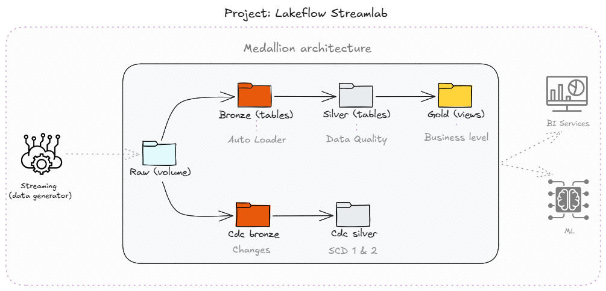
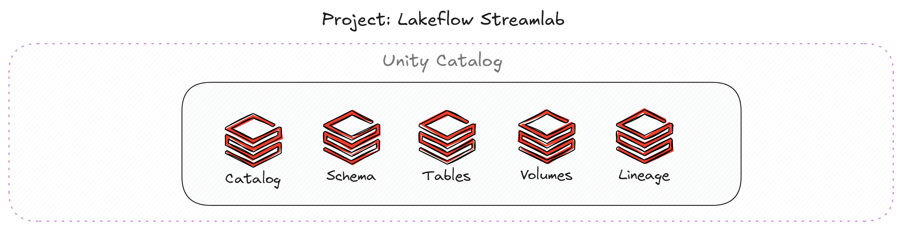
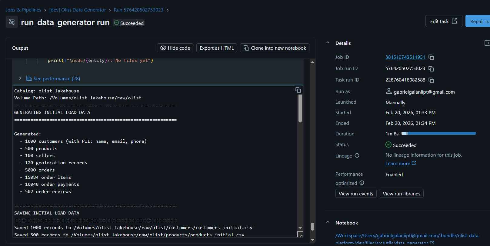
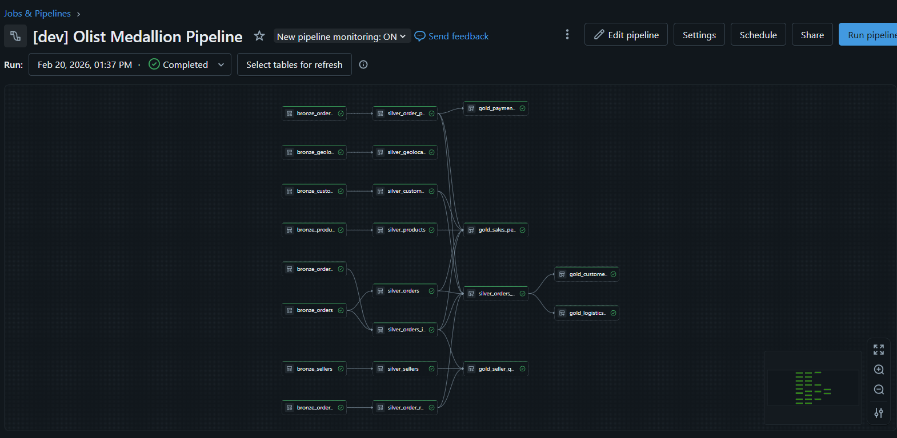
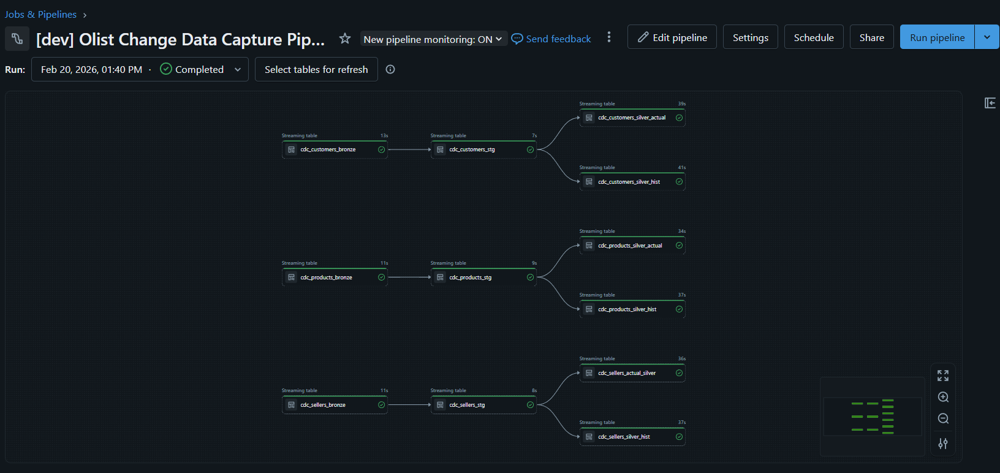

# 🚀 Data Pipeline: E-commerce Streaming & Medallion Architecture

## 🛠️ Pré-requisitos

Para executar e testar este projeto, você precisará de um dos seguintes ambientes configurados:

* **Ambiente de Desenvolvimento:** VS Code com a extensão do Databricks instalada e configurada via **Databricks Connect**.
* **Ambiente de Execução:** Uma conta ativa no Databricks (pode ser a **Community/Free Edition** para testes de lógica, embora o suporte a DLT e Bundles seja completo em instâncias **Premium/Enterprise**).
* **Databricks CLI:** Instalado e autenticado para realizar o deploy dos Assets (DABs).

## 1. Descrição do Projeto
Este projeto implementa um pipeline de dados de ponta a ponta focado em e-commerce, utilizando **Delta Live Tables (DLT)** para processamento em tempo real (Streaming). O sistema é projetado para escalar a ingestão de dados brutos até a entrega de camadas refinadas para análise, garantindo integridade e governança.

## 2. Objetivo
O objetivo principal é demonstrar a implementação da **Arquitetura Medalhão** e do **Change Data Capture (CDC)** no Databricks, automatizando a criação de infraestrutura via **Databricks Asset Bundles (DABs)** e garantindo a qualidade dos dados em cada etapa do fluxo.

## 3. Arquitetura Medalhão
A organização dos dados segue o padrão Medalhão, garantindo que a qualidade aumente conforme o dado flui pelas camadas:



| Camada | Propósito | Qualidade de Dados (Expectations) |
| :--- | :--- | :--- |
| **Bronze** | Ingestão bruta via Auto Loader | **WARN**: Monitoramento de inconformidades |
| **Silver** | Validação, limpeza e enriquecimento | **DROP**: Remoção automática de dados inválidos |
| **Gold** | KPIs de negócio e agregações finais | **FAIL**: Validação rigorosa e crítica |

### 3.1 Unity Catalog
O **Unity Catalog** atua como a camada unificada de governança para o Lakehouse.



Ele permite o gerenciamento centralizado de linhagem (*lineage*), controle de acesso (ACLs) e auditoria de todos os ativos de dados (tabelas, volumes e funções) em nível de metastore.

## 4. Tecnologias Utilizadas
* **Databricks Delta Live Tables (DLT):** Orquestração declarativa e governança do pipeline.
* **Spark Structured Streaming:** Processamento escalável em tempo real.
* **Unity Catalog:** Governança unificada e segurança de dados.
* **Python & SQL:** Desenvolvimento das transformações e lógicas de negócio.
* **Change Data Capture (CDC):** Captura eficiente de alterações em tabelas dimensionais (Clientes, Produtos).
* **Auto Loader:** Ingestão incremental e eficiente de arquivos na camada Bronze.
* **Databricks Asset Bundles (DABs):** Ferramenta de infraestrutura como código (IaC) para deploy e CI/CD.

## 📊 Monitoramento e Execução

Após iniciar os processos, você poderá acompanhar o status de execução diretamente na interface do Databricks. Abaixo estão as visualizações esperadas para cada etapa:

### Execução do Job (Orquestração)
O Job coordena a execução dos bundles e o acionamento dos fluxos de dados.


### Pipeline Medalhão (Streaming DLT)
Visualização do grafo de dependências (DAG) processando os dados das camadas Bronze e Silver em tempo real.


### Pipeline CDC (Change Data Capture)
Fluxo de sincronização de mudanças para manter as tabelas dimensionais atualizadas.


---

## 5. Estrutura do Projeto
```text
src/
├── pipelines/
│   ├── bronze/          # Scripts de ingestão inicial (Raw)
│   ├── cdc/             # Lógica de processamento CDC
│   └── silver/          # Transformações e enriquecimento
├── setup/               # Scripts de infraestrutura e permissões
│   ├── run.py           # Orquestrador de setup inicial
│   └── ...
└── utils/               # Utilitários e gerador de dados
    └── data_generator.py
```

## 6. Como Rodar o Projeto
Siga os passos abaixo para configurar o ambiente e realizar o deploy:

### Passo 1: Clonar o Repositório
```
git clone [[https://github.com/GabrielGalani/databricks-lakeflow-streamlab.git](https://github.com/seu-usuario/seu-repositorio.git)]
cd databricks-lakeflow-streamlab
```

### Passo 2: Configuração Inicial (Setup)
Execute o script de setup para preparar o Unity Catalog (schemas, volumes e permissões):
```python
./src/setup/run.py
```

### Passo 3: Deploy via Databricks Asset Bundles
Certifique-se de que o Databricks CLI está configurado e execute o deploy para criar automaticamente os recursos (Workflows e DLT):

### Passo 4: Execução dos Pipelines
Com o deploy concluído, execute os pipelines na seguinte ordem de dependência:
- Data Generator: Para popular os volumes com dados iniciais.
- Medallion: Ingestão e transformação das camadas Bronze e Silver.
- CDC: Atualização das dimensões com base nas mudanças capturadas.


